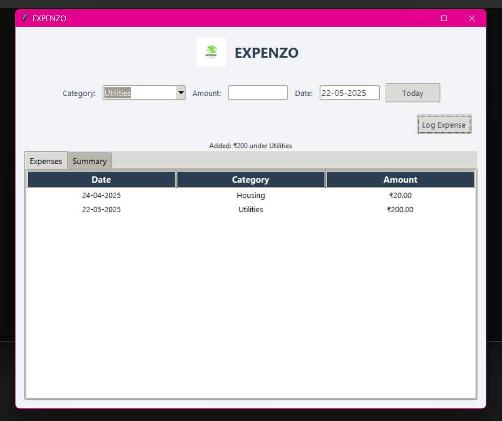

# 💸 Expenzo - Expense Tracker App

**Expenzo** is a simple desktop app to track your daily expenses. Built with Python and Tkinter, it helps you log, view, and summarize your spending in a clean and user-friendly interface.

## 📸 Screenshots

### Main Interface

*The main window showing expense entry form and recent transactions*

### Expense Summary

*Monthly and category-wise expense summaries*

## ✨ Features
- 📝 Log expenses with category, amount, and date
- ⚡ Auto-fill today's date with one click
- 📊 View all entries in a sortable table
- 📈 See summaries by **Category** and **Month**
- 💾 Automatically saves to a local `expenses.csv` file


## 🚀 Installation

1. Clone the repository:
```bash
git clone https://github.com/yourusername/ExpenZo.git
cd ExpenZo
```

2. Run the application:
```bash
python py.py
```

## 💻 Usage

1. Launch the application
2. Enter expense details:
   - Select a category
   - Enter the amount
   - Choose a date (or click "Today")
3. Click "Add Expense" to save
4. View your expenses in the table below
5. Use the summary tabs to analyze your spending
